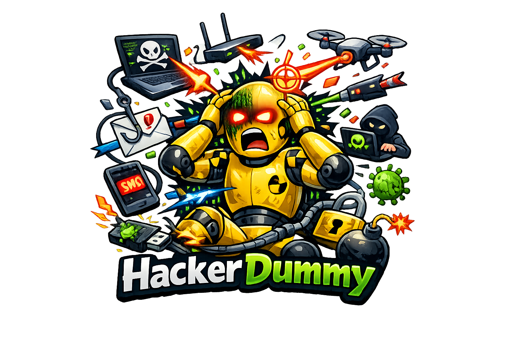

<div align="center">



# HackerDummy

### Avalie agentes com critérios que você pode inspecionar.

Conjunto de laboratórios deliberadamente vulneráveis e um harness de avaliação para comparar achados de agentes com gabaritos. O objetivo é medir cobertura e ruído em um ambiente controlado, independente do fornecedor de IA.

[](harness/score_lab.py) [](run_labs.py) [](harness/score_lab.py)

[Começar](#começar) · [Arquitetura](#arquitetura) · [Operação](docs/OPERATIONS.md) · [Limites](#limites-e-responsabilidade)

</div>

## O que você encontra

- Laboratórios web locais e artefatos de laboratório mobile.
- Gabaritos estruturados e normalização de classes de achados.
- Pontuação de precisão e recall para acompanhar regressões.

## Começar

Requisitos: Python para os laboratórios e harness em Python. O runner também reconhece um laboratório PHP, que exige seu próprio runtime; os artefatos mobile não são servidores iniciados pelo runner.

```sh
git clone https://github.com/eep0x10/HackerDummy.git
cd HackerDummy
python harness/score_lab.py --help
```

Comece pelo formato dos achados em `examples` e pela taxonomia. Separe a preparação dos laboratórios da avaliação: mantenha o gabarito com o avaliador, registre versão do agente e retenha evidências sintéticas. Só inicialize alvos na rede de laboratório controlada.

## Arquitetura

| Caminho | Responsabilidade |
| :--- | :--- |
| [`labs`](labs) | Alvos sintéticos e gabaritos dos laboratórios. |
| [`harness/score_lab.py`](harness/score_lab.py) | Comparação entre achados e gabarito. |
| [`run_labs.py`](run_labs.py) | Gerenciamento dos processos de laboratório. |
| [`ctf_platform.py`](ctf_platform.py) | Interface local de apoio ao laboratório. |
| [`TAXONOMY.md`](TAXONOMY.md) | Vocabulário de classificação. |
| [`examples`](examples) | Exemplos de dados do harness. |

## Ler o resultado

**Recall** mede quantos itens do gabarito foram encontrados. **Precisão** mede quantos achados reportados correspondem ao gabarito. Compare execuções com a mesma revisão dos laboratórios, formato de achados e condições de avaliação; uma mudança na taxonomia altera a interpretação dos números.

O runner documenta tratamento distinto para processos Python, o laboratório PHP e artefatos mobile. Não considere a ausência de um servidor mobile como falha de inicialização: esses laboratórios são materiais estáticos.

## Configuração

Os contratos de configuração estão nos manifests e arquivos de entrada indicados acima. Não há uma configuração universal que substitua a preparação do ambiente.

Use valores específicos do seu ambiente. Tokens, senhas, bancos, logs e evidências não pertencem ao README. Revise modelos de configuração antes de copiá-los e não publique suas cópias preenchidas.

## Verificação e desenvolvimento

O harness calcula métricas a partir dos arquivos fornecidos; não é prova de que cada vulnerabilidade foi reproduzida. Confira a taxonomia, o formato dos achados e a independência do gabarito antes de comparar resultados.

Os comandos de verificação descrevem o fluxo do projeto. Consulte a CI ou registre a execução no seu ambiente antes de considerar uma revisão validada; a documentação não substitui esse resultado.

## Limites e responsabilidade

Os alvos são intencionalmente inseguros. Restrinja a um laboratório local isolado e a dados sintéticos. Não exponha o runner ou aplicações à Internet. O gabarito deve permanecer fora do contexto do agente durante avaliação cega. Métricas deste conjunto não equivalem a garantia de desempenho em produção.

Use somente dados e sistemas sob sua responsabilidade ou com autorização explícita. Registre escopo, responsáveis e retenção de evidências antes de operações de segurança. Achados e relatórios precisam distinguir observação, hipótese e confirmação.

## Documentação

- [Operação, manutenção e verificação](docs/OPERATIONS.md)
- [TAXONOMY.md](TAXONOMY.md)

## Licença

Não foi encontrado um arquivo LICENSE na raiz desta revisão. A disponibilidade do código não deve ser interpretada como concessão automática de direitos de redistribuição.

[English overview](README.en.md)
